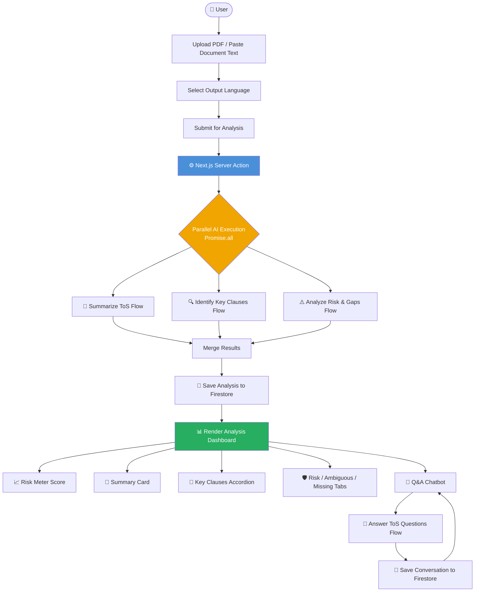
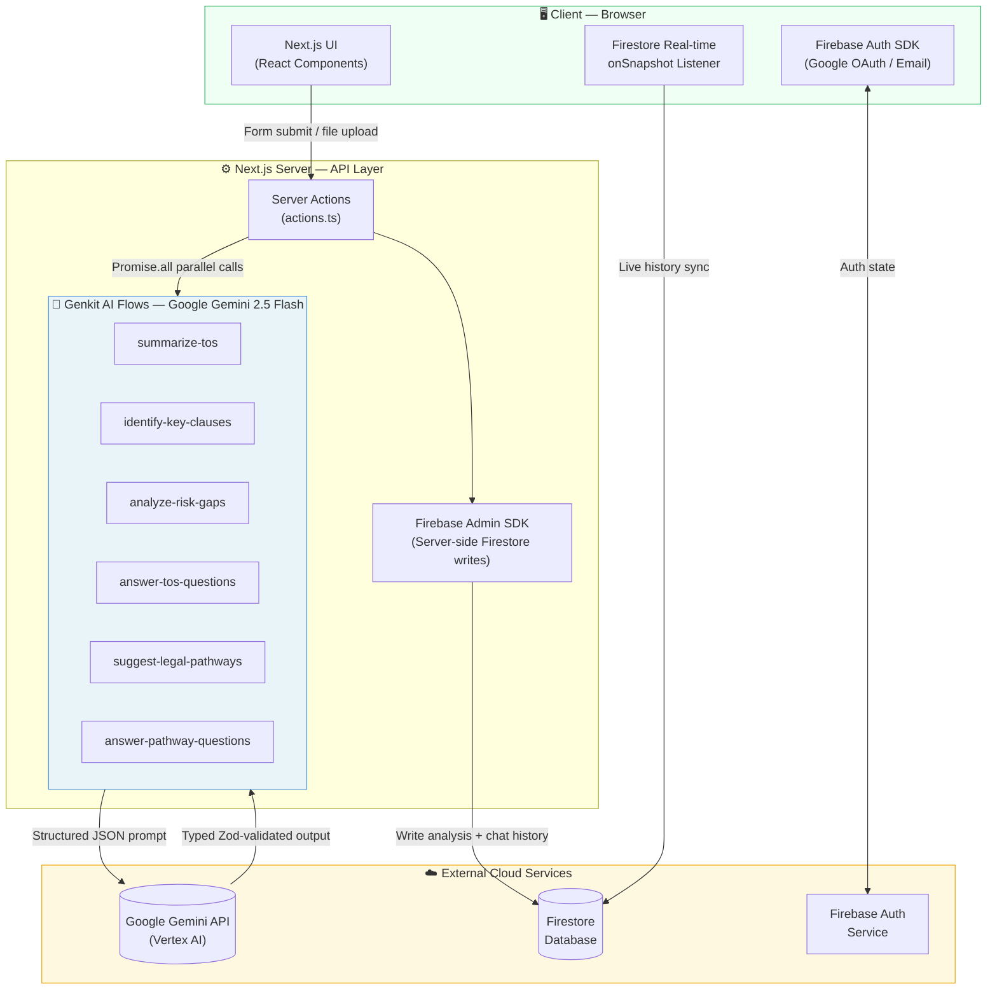

# VeriLaw — AI-Powered Legal Clarity

> Demystifying complex legal documents for individuals and new businesses in India, powered by Google Gemini AI.

---

## 📸 Screenshots

### Light Mode


### Dark Mode


---

## 💡 Project Overview

**VeriLaw** is a production-grade Generative AI platform that transforms dense legal documents into clear, actionable insights. It eliminates inaccessible legal jargon and empowers users to make informed decisions — without expensive legal counsel.

The AI layer is not a chatbot bolted onto a website. It sits on top of real document content and answers questions where being confidently wrong is a real problem. A significant part of the system is built around guardrails, structured output validation, and retrieval that keeps the model grounded in the actual document.

---

## 🔴 Problem Statement

| Challenge | Impact |
|---|---|
| **Complexity & Risk** | Legal documents are dense with jargon, exposing users to hidden risks they can't identify |
| **Foundational Barriers** | New founders struggle to navigate mandatory legal steps (registration, IP, compliance) |
| **Language Barrier** | Most legal resources are English-only, neglecting India's massive multilingual user base |

---

## ✅ Solution & USP

| Feature | Description | Unique Value |
|---|---|---|
| **Document Demystification** | Instantly converts clauses from NDAs, Leases, Loans into plain-language summaries | Bilingual: English + 7 Indian regional languages |
| **Guided Business Path** | Generates a step-by-step legal roadmap for any new startup type | Proactive guidance — before problems happen, not after |
| **Risk Meter** | Visual score assessing legal and financial pitfalls within a contract | Instantly pinpoints exactly where caution is needed |

---

## ✨ Features

| Feature | Description | Value |
|---|---|---|
| **AI-Powered Summary** | One-click plain-language summary of any legal document | Instant understanding of obligations |
| **Key Clause Identification** | Auto-finds Limitation of Liability, IP Rights, User Conduct clauses | No need to read 40 pages yourself |
| **Risk & Gap Analysis** | Discovers risks, vague language, and missing clauses under Indian law | Immediate assessment of liabilities |
| **Interactive Chatbot** | Ask contextual questions about the document in English or Hindi | Precise answers without jargon |
| **Business Guidance Path** | Step-by-step legal guide: Foundational → Growth → Scaling stages | Clear roadmap for scalable growth |
| **Document Suggester** | Checklist of Founder's Agreements, Privacy Policies, registration requirements | Ensures foundational compliance |
| **Multilingual Support** | English, Hindi, Bengali, Tamil, Telugu, Marathi, Gujarati, Kannada | Accessible to every Indian user |
| **Analysis History** | Real-time Firestore-synced history of all past analyses | Easy record-keeping and revisiting |

---

## 🔄 Process Flow



---

## 🏗️ Architecture Diagram



---

## 🧠 AI Engineering Competencies Demonstrated

This project was built as a **production AI system**, not a toy demo. The engineering decisions reflect real-world constraints where an incorrect AI answer has consequences.

### Multi-Flow AI Orchestration
- **6 typed Genkit AI flows** each with strictly validated Zod input/output schemas
- Flows are independently testable, versioned units — not ad-hoc prompt strings
- Analysis flows run in **parallel** (`Promise.all`) to minimize latency

### Structured Output & Prompt Engineering
- Every AI flow returns a **typed, validated schema** (not raw text) — equivalent to structured tool calling
- Prompts include domain-specific constraints (Indian law, DPDP Act 2023)
- Language parameter injected per-call enabling multilingual structured outputs

### Production Guardrails
- Input validation (minimum document length before AI is invoked)
- Server-side AI calls only — API keys never exposed to the client
- Legal disclaimer UI enforcing that AI output ≠ legal advice
- Graceful degradation when Firestore or Gemini is unavailable

### Stateful AI System
- Full conversation history persisted per document analysis in Firestore
- Real-time `onSnapshot` subscriptions keep history panel live without polling
- Nested Firestore collections model: `users → history → conversations`

### Context-Aware Retrieval (RAG Pattern)
- Document text injected as context into every Q&A prompt (document grounding)
- Answers are constrained to the provided document — not general knowledge hallucination
- Parallel retrieval and processing of three analysis dimensions simultaneously

### Security-First Design
- `NEXT_PUBLIC_FIREBASE_*` for client-safe config via env vars
- `FIREBASE_SERVICE_ACCOUNT_KEY` and `GOOGLE_GENAI_API_KEY` server-side only
- Firestore rules enforce `auth.uid == userId` — no cross-user data access

---

## 🛠️ Technology Stack

### AI & Intelligence Layer

| Component | Technology | Purpose |
|---|---|---|
| **LLM** | Google Gemini 2.5 Flash (via Genkit) | Summarization, analysis, Q&A, multilingual output |
| **AI Orchestration** | Google Genkit 1.22 | Flow definition, typed I/O, prompt versioning |
| **Structured Output** | Zod schemas | Enforce typed AI responses, prevent hallucinated structure |
| **Prompt Strategy** | Context injection + domain constraints | Ground answers in the actual document |

### Application Layer

| Component | Technology | Purpose |
|---|---|---|
| **Framework** | Next.js 15.3.8 (App Router + Turbopack) | Full-stack React with Server Actions |
| **Language** | TypeScript 5 | End-to-end type safety |
| **UI Components** | shadcn/ui (Radix UI) | Accessible, composable component library |
| **Styling** | Tailwind CSS v3 | Utility-first responsive design |
| **Forms** | react-hook-form + Zod | Validated form state management |
| **PDF Parsing** | pdfjs-dist | Client-side PDF text extraction |

### Data & Auth Layer

| Component | Technology | Purpose |
|---|---|---|
| **Authentication** | Firebase Auth (Google OAuth + Email) | Secure user identity |
| **Database** | Firestore (Firebase) | Real-time analysis history + conversations |
| **Admin SDK** | firebase-admin | Server-side Firestore writes from Server Actions |
| **Real-time** | Firestore `onSnapshot` | Live history updates without polling |

---

## 🚀 Getting Started

### Prerequisites
- Node.js 18+
- A Firebase project (Firestore + Auth enabled)
- A Google Gemini API key

### 1. Clone the Repository

```bash
git clone https://github.com/Gagan-Gautam-02/Legal-Lens.git
cd Legal-Lens
```

### 2. Install Dependencies

```bash
npm install
```

### 3. Configure Environment Variables

Copy the example env file and fill in your values:

```bash
cp .env.example .env.local
```

Open `.env.local` and add:

```env
# Firebase Client (from Firebase Console → Project Settings → Your Apps)
NEXT_PUBLIC_FIREBASE_API_KEY=...
NEXT_PUBLIC_FIREBASE_AUTH_DOMAIN=...
NEXT_PUBLIC_FIREBASE_PROJECT_ID=...
NEXT_PUBLIC_FIREBASE_STORAGE_BUCKET=...
NEXT_PUBLIC_FIREBASE_MESSAGING_SENDER_ID=...
NEXT_PUBLIC_FIREBASE_APP_ID=...

# Google Gemini AI (from https://aistudio.google.com/app/apikey)
GOOGLE_GENAI_API_KEY=...

# Firebase Admin SDK (Firebase Console → Project Settings → Service Accounts → Generate new private key)
FIREBASE_SERVICE_ACCOUNT_KEY={"type":"service_account", ...}
```

### 4. Run the Development Server

```bash
npm run dev
```

Open [http://localhost:9002](http://localhost:9002) in your browser.

---

## 🔐 Security

| Layer | Implementation |
|---|---|
| **Client credentials** | All Firebase config via `NEXT_PUBLIC_*` env vars — never hardcoded |
| **Server secrets** | Gemini API key and Firebase Service Account in server-only env vars |
| **Firestore Rules** | Users can only read/write their own `users/{uid}/**` data |
| **Auth Guard** | `onAuthStateChanged` redirects unauthenticated users to `/login` |
| **`.gitignore`** | `.env*` excluded; only `.env.example` (with placeholders) is committed |

---

## 🏗️ Project Structure

```
src/
├── ai/
│   ├── genkit.ts                    # Genkit + Gemini initialization
│   └── flows/
│       ├── summarize-tos.ts         # Summary flow
│       ├── identify-key-clauses.ts  # Clause extraction flow
│       ├── analyze-risk-gaps.ts     # Risk analysis flow (Indian law)
│       ├── answer-tos-questions.ts  # Document Q&A flow
│       ├── suggest-legal-pathways.ts       # Startup legal roadmap flow
│       └── answer-legal-pathways-questions.ts  # Pathway Q&A flow
├── app/
│   ├── actions.ts          # All Server Actions (AI + Firestore)
│   ├── page.tsx            # Landing page
│   ├── layout.tsx          # Root layout + theme provider
│   ├── dashboard/
│   │   ├── page.tsx        # Main analysis dashboard
│   │   └── legal-pathways/ # Startup legal guidance page
│   ├── login/page.tsx
│   └── signup/page.tsx
├── components/
│   ├── app/                # Feature-specific components
│   │   ├── analysis-display.tsx
│   │   ├── risk-meter.tsx
│   │   ├── question-area.tsx
│   │   └── ...
│   └── ui/                 # shadcn/ui base components
├── hooks/
│   ├── use-pdf-to-text.ts  # Client-side PDF text extraction
│   └── use-toast.ts
└── lib/
    ├── firebase.ts         # Firebase client initialization (env-based)
    └── utils.ts
```

---

## 📄 License

This project is for educational and demonstration purposes.

---

*Built with ❤️ using Next.js, Google Genkit, and Firebase*
